# AdminFlow

## 项目说明 

项目使用最新的技术栈（后端Java17、SpringBoot3.0，前端TypeScript、Vite3、Vue3、Element Plus），只提供了用户和权限管理(菜单权限，按钮权限)的核心功能等 

## 技术栈

* SpringBoot
* Redis
* Vue3
* Mybatis
* Mysql
* Echarts
* Jwt
* Swagger ui

## 主要特性

* 未使用任何安全框架，优雅地实现了会话管理+权限控制功能，支持页面菜单、按钮级别权限控制
* 会话通过Redis存储，即使重启也不会丢失登录状态
* 接口jwt令牌访问认证
* 利用Redis搭配Echarts进行登录人数纪录
* 采用SpringAop特性对关键操作进行日志记录
* 接入阿里云短信服务实现验证码登录
* 前端资源支持独立部署+webjars嵌入到后端应用两种形式
* 所有的接口都有端到端的测试用例覆盖，有代码变动都会全量跑一遍测试用例，保证功能绝对可用

## 功能展示

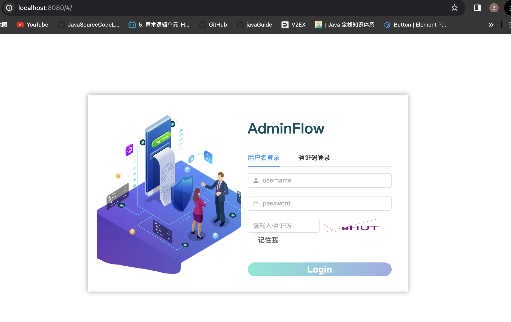

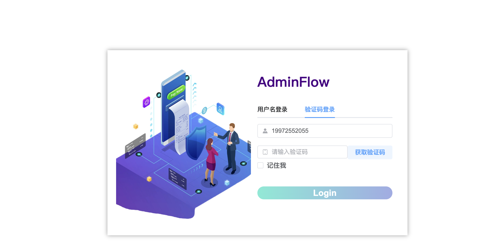

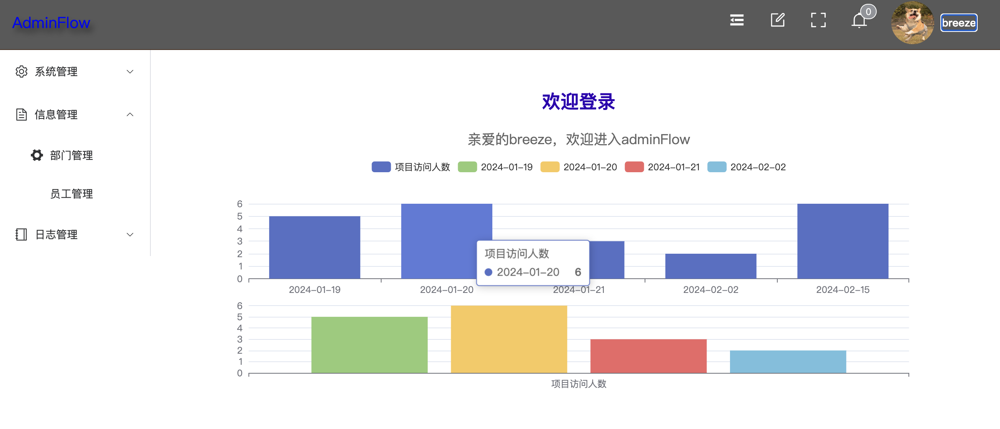

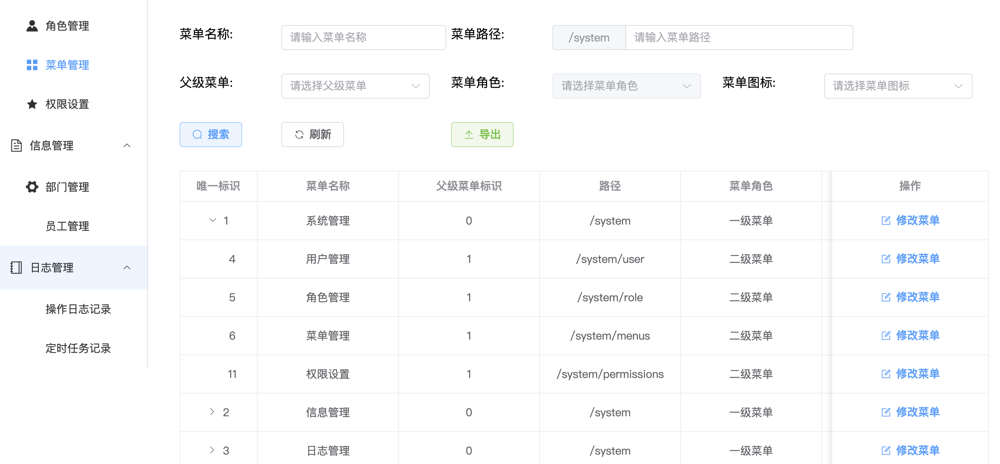

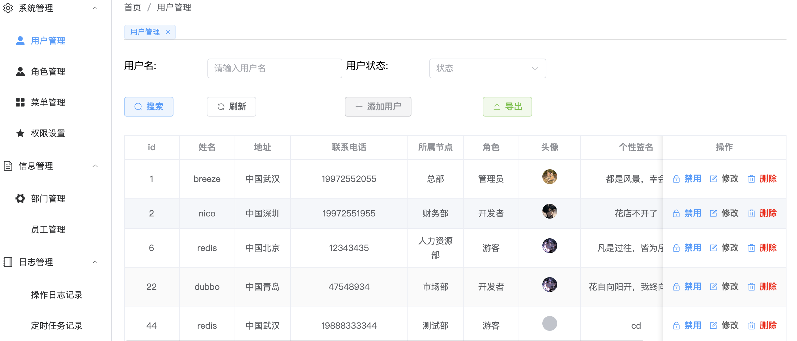

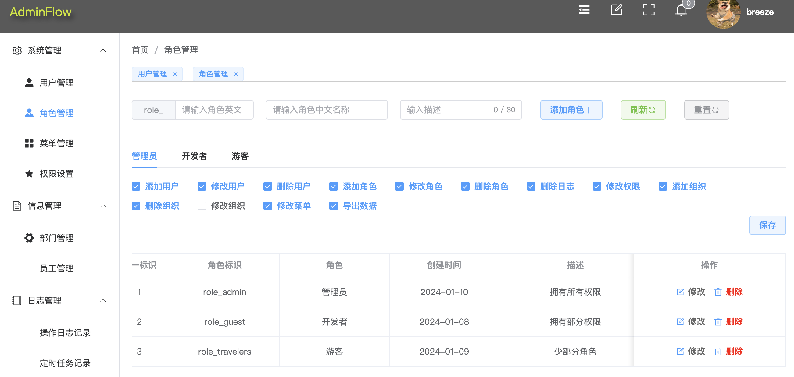

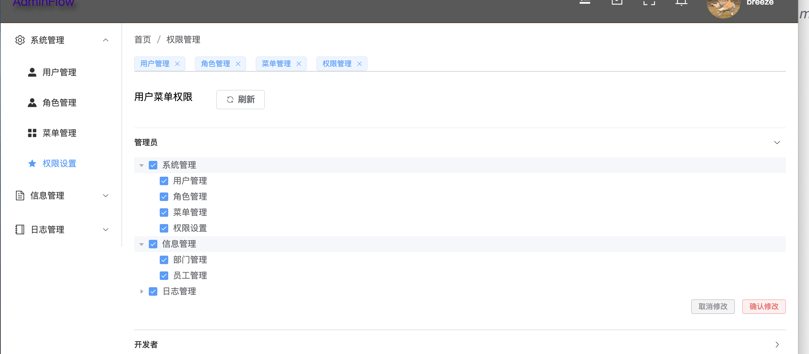

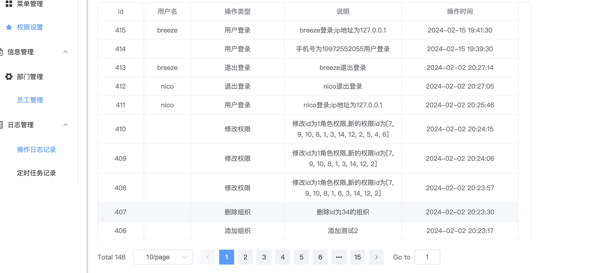

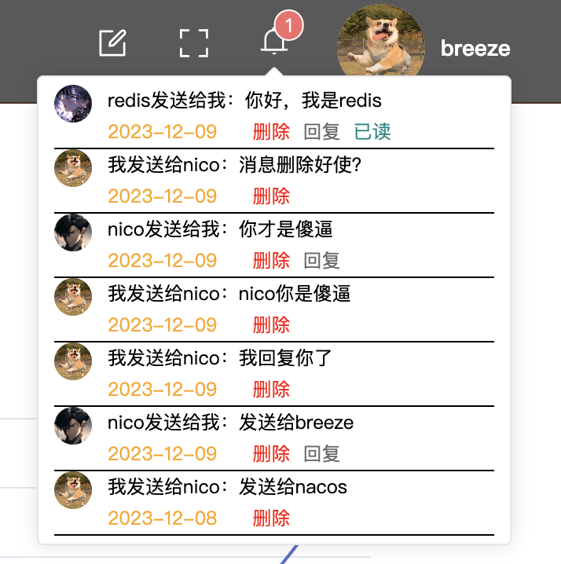

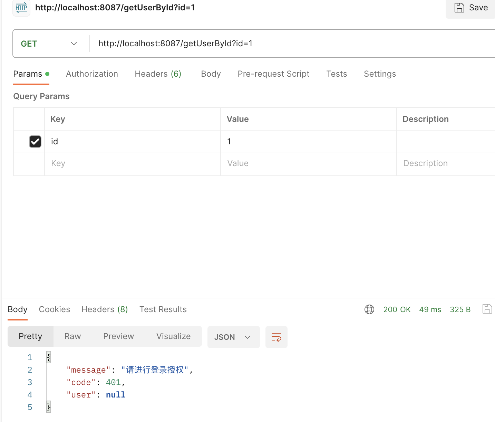

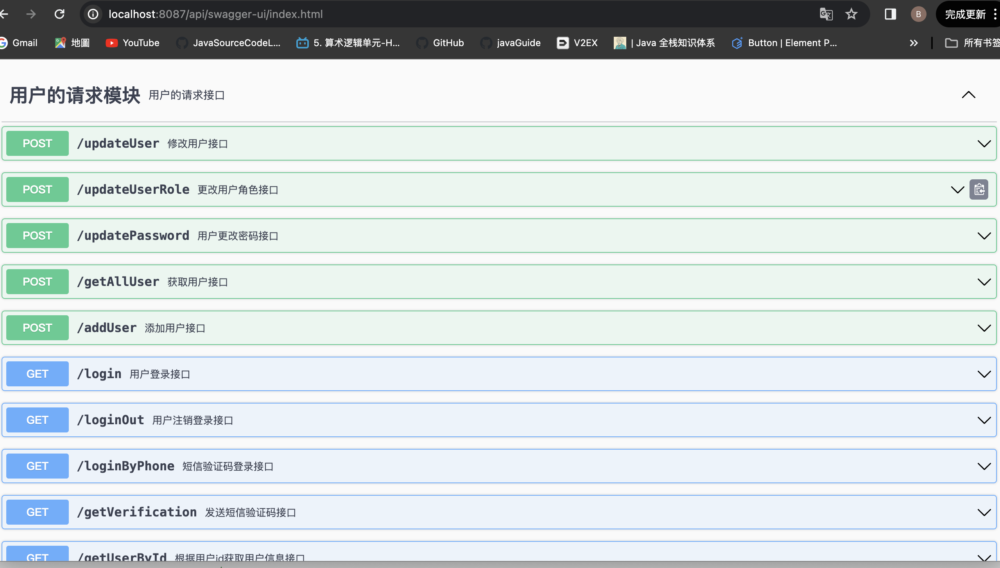

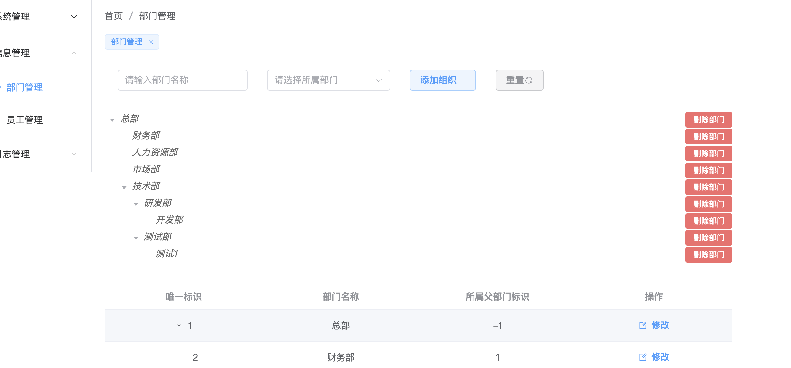
